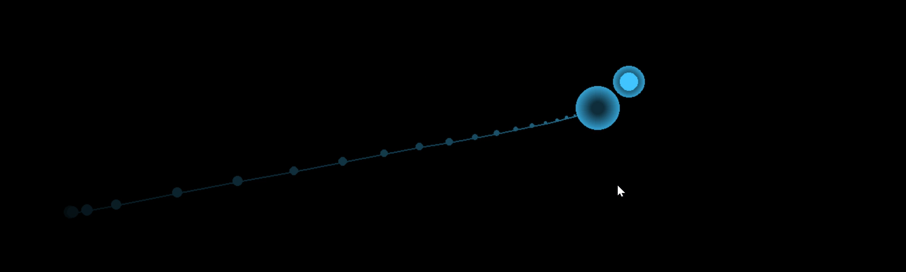
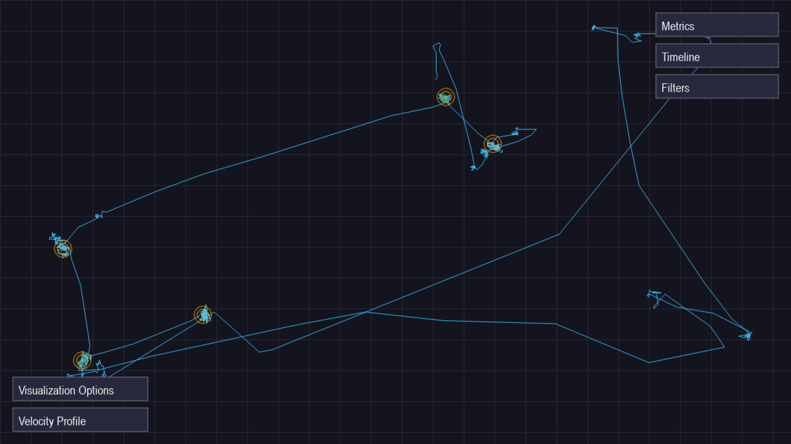
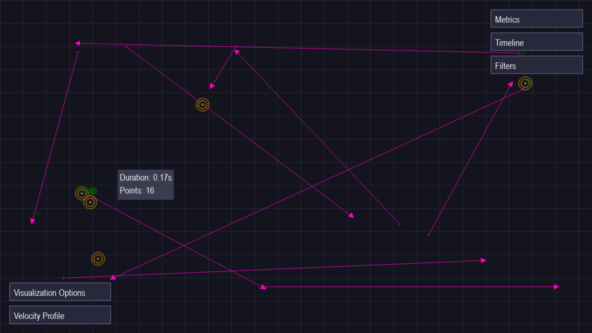
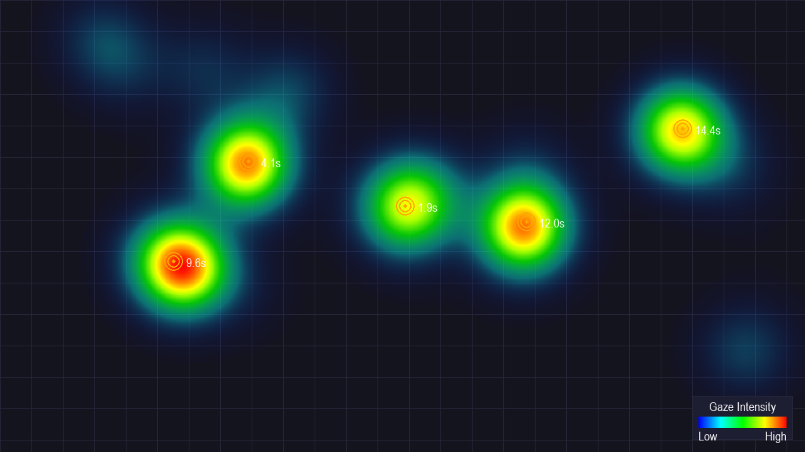

# Gaze Tracker Application for the Dot Task

A Python application that leverages eye-tracking technology to conduct the dot task, collect gaze data, perform offline analysis to detect fixations and saccades, and generate insightful visualizations including gaze paths, fixations, saccades, heatmaps, and analytical metrics (and allow for filtering, highlighting etc.). 

## Table of Contents

- [Features](#features)
- [Demo Visualizations](#demo-visualizations)
- [Prerequisites](#prerequisites)
- [Installation](#installation)
- [Usage](#usage)
- [Project Structure](#project-structure)
- [Module Descriptions](#module-descriptions)
  - [Processors](#processors)
    - [GazeProcessor](#gazeprocessor)
    - [GazeAnalyzer](#gazeanalyzer)
    - [TargetProcessor](#targetprocessor)
  - [Views](#views)
    - [VerificationView](#verificationview)
    - [AnalysisView](#analysisview)
    - [HeatmapView](#heatmapview)
    - [BaseView](#baseview)
    - [Components](#components)
- [Class Diagrams](#class-diagrams)
- [License](#license)
- [Acknowledgments](#acknowledgments)

## Features

- **Real-time Gaze Data Capture**: Collects gaze data using a Tobii eye tracker.
- **Dot Task Execution**: Presents a series of targets that the user fixates on, facilitating gaze data collection.
- **Gaze Data Processing**: Processes raw gaze data to identify fixations and saccades.
- **Comprehensive Analysis**: Computes various gaze metrics like fixation durations, saccade amplitudes, velocities, and more.
- **Interactive Visualizations**:
  - **Gaze Path Visualization**: Displays the user's gaze path over time.
  - **Fixations and Saccades**: Highlights detected fixations and saccades with interactive tooltips.
  - **Heatmap Generation**: Creates a heatmap representation of gaze intensity across the screen.
  - **Metrics Summary**: Shows aggregated metrics in an easy-to-read panel.
- **User Interaction**: Allows toggling between different visualization modes and filtering of gaze events.
- **Modular Design**: Organized codebase with clear separation between data processing and visualization components.

## Demo Visualizations

*Please note: The visualizations below are for illustrative purposes. To see the actual visualizations, run the application with a compatible eye tracker.*

### Gaze Path Visualization



*The gaze path visualization shows the trajectory of the user's eye movements across the screen during the dot task.*



*The scan path visualization shows the trajectory of the user's eye movements across the screen after  the dot task.*
### Fixations and Saccades



*Detected fixations are indicated by green circles, while saccades are represented by lines connecting fixations. Hovering over these elements displays detailed information.*

### Heatmap



*The heatmap shows areas of high gaze concentration, indicating where the user spent most of their visual attention.*


## Prerequisites

- **Python 3.7 or higher**
- **Tobii Eye Tracker**: Compatible with Tobii Pro eye trackers supporting the Tobii Pro SDK (`tobii_research`).
- **Pygame**: For rendering the visual interface.
- **NumPy**: For numerical computations.
- **SciPy**: Specifically for heatmap generation (Gaussian filtering).

## Installation

1. **Create a Virtual Environment (Optional but Recommended)**

   ```bash
   python3 -m venv venv
   source venv/bin/activate  # On Windows use `venv\Scripts\activate`
   ```

2. **Install Dependencies**

   ```bash
   pip install -r requirements.txt
   ```

   Ensure that the `requirements.txt` file includes:

   ```
   pygame
   numpy
   scipy
   tobii-research
   ```

3. **Install Tobii Pro SDK**

   - Download and install the [Tobii Pro SDK](https://developer.tobii.com/vision/software-tools/tobii-pro-sdk/).
   - Ensure that the `tobii_research` module is correctly installed and accessible to your Python environment.

## Usage

1. **Connect the Tobii Eye Tracker**

   Ensure that your Tobii eye tracker is properly connected to your computer and calibrated using the manufacturer's software.

2. **Run the Application**

   ```bash
   python main.py
   ```

3. **Conduct the Dot Task**

   The application will start in verification mode, presenting a series of target dots. Focus your gaze on each dot until it registers and moves to the next.

4. **View Analysis**

   Once all targets are completed, the application will switch to the analysis view, displaying your gaze data.

5. **Toggle Visualizations**

   - **Switch between Analysis and Heatmap Views**: Press `F` key.
   - **Toggle Visualization Options**: Use the on-screen buttons to toggle gaze path, fixations, saccades, etc.
   - **Apply Filters**: Use the filter panel to adjust fixation duration and saccade distance thresholds.

6. **Reset Session**

   To start a new session, press the `SPACE` key when in the analysis or heatmap view.

7. **Exit the Application**

   Press the `ESCAPE` key.

## Project Structure

```
gaze-tracker-dot-task/
│
├── main.py
├── processors/
│   ├── __init__.py
│   ├── gaze_analyzer.py
│   ├── gaze_processor.py
│   └── target_processor.py
├── views/
│   ├── __init__.py
│   ├── analysis_view.py
│   ├── base_view.py
│   ├── components.py
│   ├── heatmap_view.py
│   └── verification_view.py
├── images/
│   └── (Visualization images used in the README)
├── requirements.txt
└── README.md
```

- **main.py**: The entry point of the application.
- **processors/**: Contains modules for processing gaze data.
- **views/**: Contains modules for visualizing data using Pygame.
- **images/**: Placeholder for images used in the README.
- **requirements.txt**: A list of Python package dependencies.

## Module Descriptions

### Processors

#### GazeProcessor

- **File**: `gaze_processor.py`
- **Purpose**: Manages real-time collection and smoothing of gaze data from the eye tracker. Stores raw gaze points for offline analysis.
- **Key Functions**:
  - `process_gaze_data(gaze_data)`: Processes incoming gaze data.
  - `calculate_velocity(pos1, pos2, dt)`: Calculates gaze movement velocity.
  - `smooth_position(current, target)`: Smooths the raw gaze data for visualization.
- **Usage**: Used during the verification phase to collect and process gaze data.

#### GazeAnalyzer

- **File**: `gaze_analyzer.py`
- **Purpose**: Performs offline analysis of recorded gaze data to detect fixations and saccades and computes various gaze metrics.
- **Key Functions**:
  - `_detect_events(gaze_points)`: Identifies fixations and saccades.
  - `calculate_metrics()`: Computes metrics such as mean fixation duration, saccade amplitudes, etc.
- **Usage**: Instantiated after data collection to analyze the gaze data.

#### TargetProcessor

- **File**: `target_processor.py`
- **Purpose**: Manages the generation and handling of target positions for the dot task. Tracks fixation durations on targets and records completion times.
- **Key Functions**:
  - `generate_positions(n_positions)`: Generates random target positions.
  - `check_gaze(gaze_pos)`: Checks if a user's gaze is on the current target and updates fixation status.
- **Usage**: Used to orchestrate the dot task during the verification phase.

### Views

#### VerificationView

- **File**: `verification_view.py`
- **Purpose**: Displays the dot task to the user, showing targets and real-time gaze feedback.
- **Key Functions**:
  - `draw(current_gaze, dot_position, ...)`: Renders the verification view.
- **Usage**: Active during the dot task, providing visual feedback to the user.

#### AnalysisView

- **File**: `analysis_view.py`
- **Purpose**: Provides an interactive analysis interface showing gaze paths, fixations, saccades, metrics, and allows users to interact with the data.
- **Components**:
  - **GazePathVisualization**
  - **FixationsVisualization**
  - **SaccadesVisualization**
  - **MetricsSummaryVisualization**
  - **VelocityProfileVisualization**
  - **FilterPanel**
  - **TimelinePanel**
- **Key Functions**:
  - `draw(gaze_points, fixations, saccades, ...)`: Renders the analysis view.
  - `handle_event(event)`: Handles user interactions.
- **Usage**: Active after data collection, allowing users to explore their gaze data.

#### HeatmapView

- **File**: `heatmap_view.py`
- **Purpose**: Generates and displays a heatmap of gaze data, showing areas of high visual attention.
- **Key Functions**:
  - `start_generation(gaze_points)`: Starts the heatmap generation process.
  - `draw(gaze_points, target_positions, ...)`: Renders the heatmap view.
- **Usage**: Accessible after data collection to visualize gaze intensity.

#### BaseView

- **File**: `base_view.py`
- **Purpose**: Base class for all views, providing common drawing utilities and screen management.
- **Key Functions**:
  - `draw_grid()`: Draws a grid background.
  - `draw_text(text, position)`: Renders text on the screen.
- **Usage**: Inherited by all specific view classes.

#### Components

- **File**: `components.py`
- **Purpose**: Contains classes for individual visualization components used within the AnalysisView.
- **Classes**:
  - `GazePathVisualization`
  - `FixationsVisualization`
  - `SaccadesVisualization`
  - `MetricsSummaryVisualization`
  - `VelocityProfileVisualization`
  - `TimelinePanel`
  - `FilterPanel`