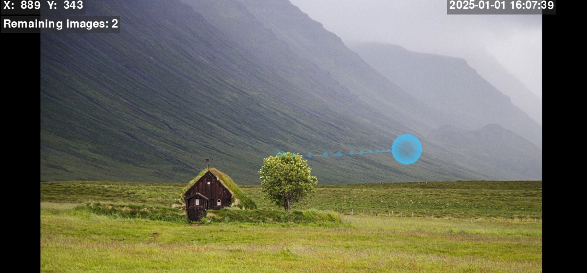

# GazeImageViewer: Image-Based Gaze Tracking Application

A Python application that leverages eye-tracking technology to display a sequence of images, collect gaze data, perform analysis, and generate insightful visualizations including gaze overlays and heatmaps.

## Table of Contents

- [Features](#features)
- [Demo Visualizations](#demo-visualizations)
- [Prerequisites](#prerequisites)
- [Installation](#installation)
- [Usage](#usage)
- [Project Structure](#project-structure)
- [Module Descriptions](#module-descriptions)
  - [Processors](#processors)
    - [GazeProcessor](#gazeprocessor)
  - [Views](#views)
    - [BaseView](#baseview)
    - [ImageTaskView](#imagetaskview)
    - [ImageAnalysisView](#imageanalysisview)
- [License](#license)
- [Acknowledgments](#acknowledgments)

## Features

- **Real-time Gaze Tracking**: Collects gaze data using a Tobii eye tracker while displaying images.
- **Image Sequence Display**: Presents a series of images to the user for a specified duration.
- **Gaze Visualization**: Overlays gaze points and trails on images to visualize user's viewing patterns in real-time.
- **Heatmap Generation**: Creates heatmaps for each image based on the collected gaze data to highlight areas of interest.
- **User Interaction**: Allows navigation through images and heatmaps using keyboard controls.
- **Modular Design**: Organized codebase with clear separation between data processing and visualization components.

## Demo Visualizations

*Please note: The visualizations below are for illustrative purposes. To see the actual visualizations, run the application with a compatible eye tracker.*

### Gaze Overlay on Images



*Real-time gaze overlay and trail on the images during the image task phase.*

### Heatmap Overlays


*Heatmaps generated over each image, showing gaze intensity zones.*

## Prerequisites

- **Python 3.6 or higher**
- **Tobii Eye Tracker**: Compatible with Tobii eye trackers supporting the Tobii Pro SDK (`tobii_research`).
- **Pygame**: For rendering graphics and handling user interactions.
- **NumPy**: For numerical computations.
- **SciPy**: For generating heatmaps using Gaussian filters.

## Installation

1. **Create a Virtual Environment (Optional but Recommended)**

   ```bash
   python -m venv venv
   source venv/bin/activate  # On Windows: venv\Scripts\activate
   ```

2. **Install Dependencies**

   ```bash
   pip install -r requirements.txt
   ```

   Ensure that the `requirements.txt` file includes:

   ```
   pygame
   numpy
   scipy
   tobii-research
   ```

3. **Install Tobii Pro SDK**

   - Download and install the [Tobii Pro SDK](https://developer.tobii.com/).

4. **Add Images to the `images/` Directory**

   Place the images you want to display during the image task phase into the `images/` directory. Supported formats include `.jpg`, `.jpeg`, and `.png`.

## Usage

1. **Connect the Tobii Eye Tracker**

   Ensure that your Tobii eye tracker is properly connected to your computer and calibrated using the manufacturer's software.

2. **Run the Application**

   ```bash
   python main.py
   ```

3. **Image Task Phase**

   - The application will start and display images from the `images/` directory.
   - Each image is displayed for a set duration (default is 2 seconds).
   - While the image is displayed, the application captures real-time gaze data.
   - Gaze visualization (trails and glow effects) is overlaid on the images.


4. **Heatmap Analysis Phase**

   - After all images have been displayed, the application transitions to the analysis view.
   - Heatmaps are generated for each image based on the collected gaze data.
   - Users can navigate through heatmaps to analyze gaze intensity over images.


5. **User Controls**

   - **Left/Right Arrow Keys**: Navigate between heatmaps in the analysis view.
   - **G**: Toggle gaze overlay on/off during the image task phase.
   - **Spacebar**: Reset the session (only in the analysis view).
   - **ESC**: Exit the application.

6. **Reset Session**

   To start a new session, press the `Spacebar` when in the analysis view.

## Project Structure

```
GazeImageViewer/
├── images/
├── processors/
│   ├── __init__.py
│   └── gaze_processor.py
├── views/
│   ├── __init__.py
│   ├── base_view.py
│   ├── image_task_view.py
│   └── image_analysis_view.py
└── main.py
```

- **images/**: Contains the image files to be displayed during the image task phase.
- **processors/**: Contains the gaze processing module.
- **views/**: Contains the different view modules for rendering and interaction.
- **main.py**: Entry point of the application.

## Module Descriptions

### Processors

#### GazeProcessor

- **File**: `gaze_processor.py`
- **Purpose**: Manages real-time collection and smoothing of gaze data from the eye tracker. Stores raw gaze points for offline analysis.
- **Key Classes and Functions**:
  - `GazePoint`: Data class representing a gaze point with timestamp, position, and velocity.
  - `GazeProcessor`: Class that handles processing of gaze data.
    - `process_gaze_data(gaze_data)`: Processes incoming gaze data.
    - `calculate_velocity(pos1, pos2, dt)`: Calculates gaze movement velocity.
    - `smooth_position(current, target)`: Smooths the raw gaze data for visualization.
- **Usage**: Used during the image task phase to collect and process gaze data.

### Views

#### BaseView

- **File**: `base_view.py`
- **Purpose**: Base class for all views, providing common drawing utilities and screen management.
- **Key Functions**:
  - `draw_aa_circle(surface, center, radius, color)`: Draws an anti-aliased circle.
  - `draw_text(text, position)`: Renders text on the screen.
  - `draw_grid()`: Draws a grid overlay on the screen.
- **Usage**: Inherited by all specific view classes to provide common functionality.

#### ImageTaskView

- **File**: `image_task_view.py`
- **Purpose**: Handles displaying a sequence of images while tracking gaze, with timing and sequence logic encapsulated.
- **Key Functions**:
  - `set_images(image_paths)`: Initializes the image sequence.
  - `draw(current_gaze, gaze_history, remaining_images)`: Renders the image and gaze overlay.
  - `toggle_gaze_overlay()`: Toggles the visibility of the gaze overlay.
- **Usage**: Active during the image task phase, managing image presentation and gaze visualization.

#### ImageAnalysisView

- **File**: `image_analysis_view.py`
- **Purpose**: Displays and manages heatmaps overlaid on their corresponding images.
- **Key Functions**:
  - `load_images_and_data(image_paths, gaze_data_per_image)`: Loads images and corresponding gaze data.
  - `start_heatmap_generation()`: Initiates background heatmap generation.
  - `draw()`: Renders the heatmap view.
  - `handle_input(event)`: Handles user navigation between heatmaps.
- **Usage**: Active after the image task phase to analyze gaze data via heatmaps.
